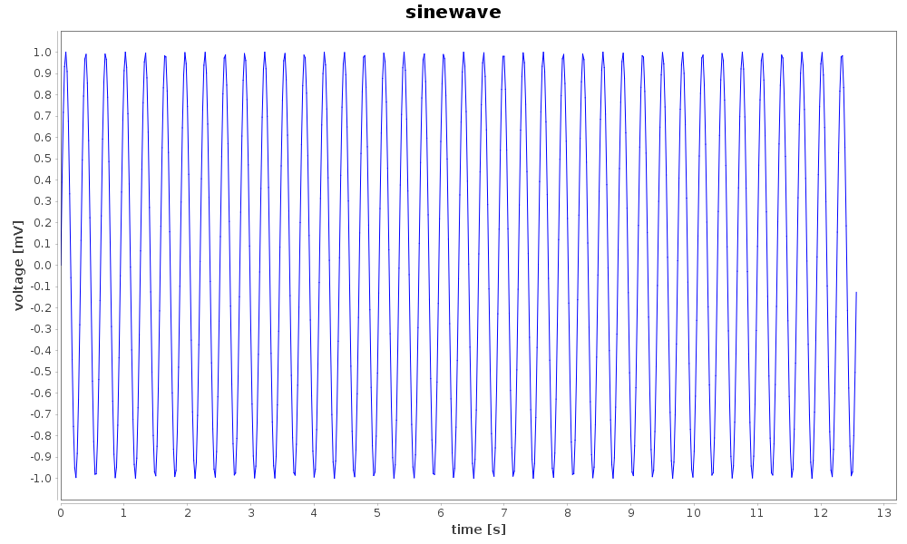
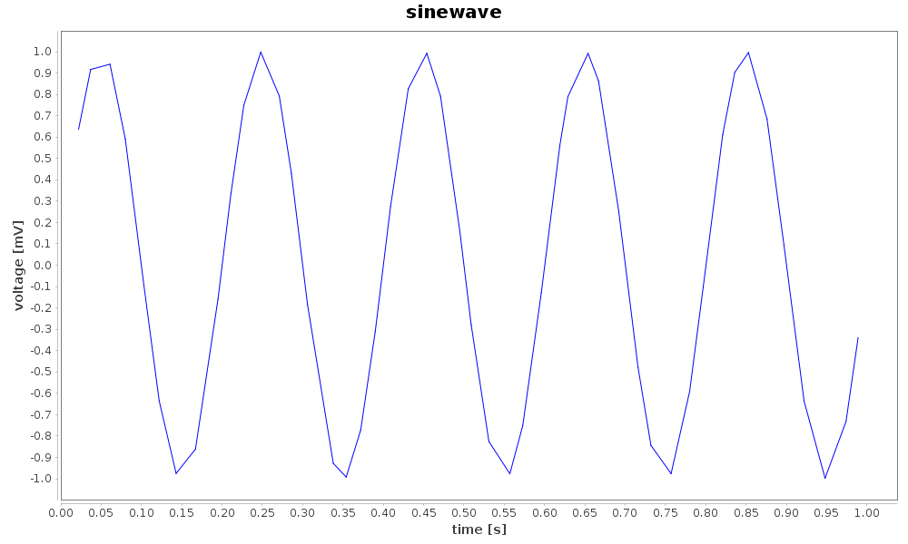

Basic data structures
---------------------

In this section we will show how different kinds of data are stored in nix files. We will start with simple regularly and irregularly sampled signals, turn to series of such signals and end with images stacks.

### Regularly sampled data

Regularly sampled data is everything which is sampled in regular intervals in space, time, or something else. Let’s consider a signal that has been digitized using an AD-Converter at a fixed sampling rate. In this case the axis representing time has to be described using a SampledDimension. This dimension descriptor contains as mandatory element the sampling_interval. The sampling_interval has to be given because it also applies e.g. to spatial sampling, it is the more general term than the sampling rate which may appear appropriate for time discretization. Further, the unit in which this number has to be interpreted and a label for the axis can be specified. The following code illustrates how this is stored in nix files.


```java
        
        // create a 'Block' that represents a grouping object. Here, the
        // recording session.
        // it gets a name and a type
        Block block = file.createBlock("block name", "nix.session");

        // create a 'DataArray' to take the sinewave, add some information about
        // the signal
        DataArray data = block.createDataArray("sinewave",
                "nix.regular_sampled", DataType.Double, new NDSize(
                        new int[]{y.length}));
        data.setData(y, data.getDataExtent(), new NDSize());
        data.setUnit("mV");
        data.setLabel("voltage");

        // add a descriptor for the xaxis
        SampledDimension dim = data.appendSampledDimension(stepsize);
        dim.setUnit("s");
        dim.setLabel("time");
        dim.setOffset(0.0);        

```

###### Output



Source code of this example: [RegularlySampledData.java](examples/RegularlySampledData.java)


### Irregularly sampled data

Irregularly sampled data is sampled at irregular intervals. The dimension which is sampled in this way has to be described using a RangeDimension. This dimension descriptor stores besides the unit and label of the axis the ticks, e.g. time-stamps of the instances at which the samples were taken.


```java
        
        // create a 'DataArray' to take the data, add some information about the signal
        DataArray data = block.createDataArray("sinewave", "nix.irregular_sampled", DataType.Double, new NDSize(
                new int[]{y.length}));
        data.setData(y, data.getDataExtent(), new NDSize());
        data.setUnit("mV");
        data.setLabel("voltage");

        // add a descriptor for the xaxis
        RangeDimension dim = data.appendRangeDimension(times);
        dim.setUnit("s");
        dim.setLabel("time");   

```

###### Output



Source code of this example: [IrregularlySampledData.java](examples/IrregularlySampledData.java)


### Series of signals

It is possible to store multiple signals that have the same shape and logically belong together in the same DataArray object. In this case, the data is two-dimensional and two dimension-descriptors are needed. Depending on the layout of the data one dimension represents time and is described with a SampledDimension while the other represents the various signals. This is described with a SetDimension. A SetDimension can have labels for each entry along this dimension of the data.


```java
        
        DataArray data = block.createDataArray("waveforms", "nix.regular_sampled.multiple_series", DataType.Double, new NDSize(
                new int[]{y.length}));
        data.setData(y, data.getDataExtent(), new NDSize());
        data.setUnit("mV");
        data.setLabel("voltage");

        // descriptor for first dimension is a set
        SetDimension set_dim = data.appendSetDimension();
        set_dim.setLabels(Arrays.asList("sin", "cos"));

        // add a descriptor for the xaxis
        SampledDimension dim = data.appendSampledDimension(stepsize);
        dim.setUnit("s");
        dim.setLabel("time");
        dim.setOffset(0.0);
```

###### Output


Source code of this example: [MultipleTimeSeries.java](examples/MultipleTimeSeries.java)


### Image data

Color images can be stored as 3-D data in a DataArray. The first two dimensions represent width and height of the image while the 3rd dimension represents the color channels. Accordingly, we need three dimension descriptors. The first two are SampledDimensions since the pixels of the image are regularly sampled in space. The third dimension is a SetDimension with labels for each of the channels. In this tutorial the “Lenna” image is used. Please see the author attribution in the code.

```java
        
        //create a 'DataArray'
        DataArray data = block.createDataArray("lenna", "nix.image.rgb", DataType.Int8, new NDSize(new int[]{pix.length}));
        data.setData(pix, data.getDataExtent(), new NDSize());

        // add descriptors for width, height and channels
        SampledDimension height_dim = data.appendSampledDimension(1);
        height_dim.setLabel("height");
        SampledDimension width_dim = data.appendSampledDimension(1);
        width_dim.setLabel("width");
        SetDimension color_dim = data.appendSetDimension();
        color_dim.setLabels(Arrays.asList("R", "G", "B"));
```

###### Output


Source code of this example: [ImageData.java](examples/ImageData.java)