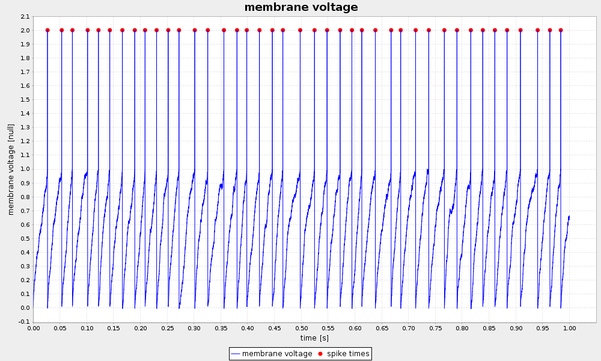

Tagging regions
---------------

One key feature of the nix-model is its ability to annotate, or “tag”, points or regions-of-interest in the stored data. This feature can be used to state the occurrence of events during the recording, to state the intervals of a certain condition, e.g. a stimulus presentation, or to mark the regions of interests in image data. In the nix data-model two types of Tags are discriminated. (1) the Tag for single points or regions, and (2) the MultiTag to annotate multiple points or regions using the same entity.

### Single point or region

Single points of regions-of-interest are annotated using a Tag object. The Tag contains the start position and, optional, the extent of the point or region. The link to the data is established by adding the DataArray that contains the data to the list of references. It is important to note that position and extent are arrays with the length matching the dimensionality of the referenced data. The same Tag can be applied to many references as long as position and extent can be applied to these.


```java
        
        // create a Tag, position and extent must be 3-D since the data is 3-D
        double[] position = {250, 250, 0};
        double[] extent = {30, 100, 3};
        Tag tag = block.createTag("Region of interest", "nix.roi", position);
        tag.setExtent(extent);
        tag.setReferences(Arrays.asList(data));      

```

###### Output


Source code of this example: [SingleROI.java](examples/SingleROI.java)


### Multiple points or regions

For tagging multiple regions of interest in the same data the MultiTag object is used. Unlike the simple Tag from the previous example, the multiple positions and extents can be given. These are stored in DataArray objects. The tagged dataset is linked via the references. There are some restrictions regarding the DataArrays storing positions and extents. The data stored in them must be 2-dimensional. Both dimensions are SetDimensions representing the individual positions and the positions in the referenced data, respectively. Thus, the second dimension has as many entries as the referenced data has dimensions.

In the following example we will declare multiple ROIs in a image. The image as a spatial extent and three color channels, is hence 3-D. The same mechanism can, of course, be used to tag other event in different kinds of data. For example in the neuroscience context: the detection of action potentials in a recorded membrane potential.

```java
        
        double[] roi_starts = {
                250, 245, 0,
                250, 315, 0,
                340, 260, 0
        };

        double[] roi_extents = {
                30, 45, 3,
                30, 40, 3,
                25, 65, 3
        };
        
        // create the positions DataArray
        DataArray positions = block.createDataArray("ROI positions", "nix.positions",
                DataType.Double, new NDSize(new int[]{3 * 3}));
        positions.setData(roi_starts, positions.getDataExtent(), new NDSize());
        positions.appendSetDimension(); // these can be empty
        positions.appendSetDimension();

        // create the extents DataArray
        DataArray extents = block.createDataArray("ROI extents", "nix.extents",
                DataType.Double, new NDSize(new int[]{3 * 3}));
        extents.setData(roi_extents, extents.getDataExtent(), new NDSize());
        extents.appendSetDimension();
        extents.appendSetDimension();

        // create a MultiTag
        MultiTag multi_tag = block.createMultiTag("Regions of interest", "nix.roi", positions);
        multi_tag.setExtents(extents);
        multi_tag.setReferences(Arrays.asList(data));

```

###### Output


Source code of this example: [MultipleROI.java](examples/MultipleROI.java)


### Tagging spikes in membrane potential

Neuroscience example. The same construct as above is used to mark the times at which action potentials were detected in the recording of a neuron’s membrane potential.

```java
        
        // create a 'DataArray' to take the sinewave, add some information about
        // the signal
        DataArray data = block.createDataArray("membrane voltage",
                "nix.regular_sampled", DataType.Double, new NDSize(
                        new int[]{voltage.length}));
        data.setData(voltage, data.getDataExtent(), new NDSize());
        data.setLabel("membrane voltage");
        // add descriptors for time axis
        SampledDimension time_dim = data.appendSampledDimension(time[1] - time[0]);
        time_dim.setLabel("time");
        time_dim.setUnit("s");

        // create the positions DataArray
        DataArray positions = block.createDataArray("times", "nix.positions", DataType.Double,
                new NDSize(new int[]{spike_times.length}));
        positions.setData(spike_times, positions.getDataExtent(), new NDSize());
        positions.appendSetDimension();
        positions.appendSetDimension();

        // create a MultiTag
        MultiTag multi_tag = block.createMultiTag("spike times", "nix.events.spike_times", positions);
        multi_tag.setReferences(Arrays.asList(data));
```

###### Output



Source code of this example: [SpikeTagging.java](examples/SpikeTagging.java)

